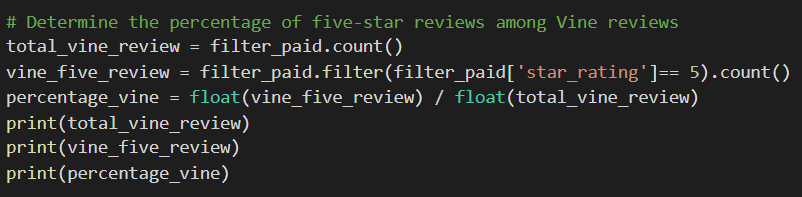
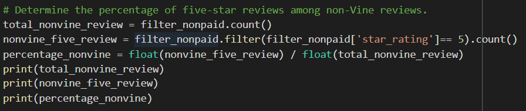

# Amazon_Vine_Analysis

## Purpose
We will help BigMarket analyze reviews of products sold by competitors compared to similar products of their own. We will use Big Data analysis to extract data and understand how the reviews compare.

## Results
**How many Vine reviews and non-Vine reviews were there?**  
We created dataframes from the reviews that showed the total of vine reviews and non-vine reviews using the coding shown below:  

There were a total of 61 vine reviews and 28,287 non-vine reviews.
 
**How many Vine reviews were 5 stars? How many non-Vine reviews were 5 stars?**  
There were 20 vine 5 star reviews. There were 15,689 non-vine 5 star reviews.  
**What percentage of Vine reviews were 5 stars? What percentage of non-Vine reviews were 5 stars?**  
The percent 5 star reviews for all vine reviews was 32.8%. The percent of non-vine 5 star reviews was 55.5%.

## Summary 
**Is there any positivity bias for reviews in the Vine program?**  
Based on my analysis, there is not a positivity bias for the vine reviews. Only 32.8% reviews were 5 star reviews. Due to no incentive to leave soley 5 star reviews, there is less likely bias in reviews left. We can also run NLP analysis to understand what key words were popular among 5 star reviews for both paid and non-paid to see if there is any differences in that case.
